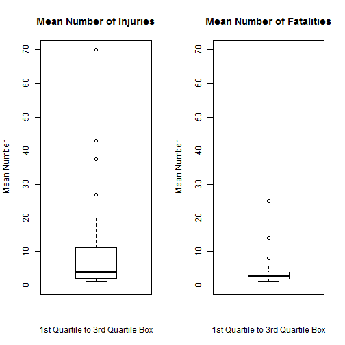
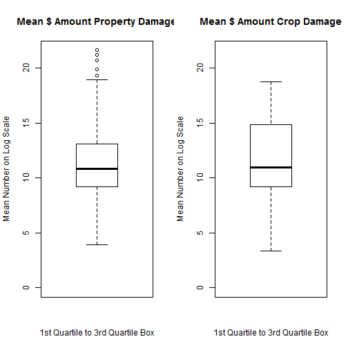

Heat and Storms in the United States Negatively 
===============================================
Impact Human Life and 
=======================
Cost Billions in Property and Food Loss
=======================================
### Johns Hopkins and Coursera
### Reproducible Research Class
### Peer Assessment 2

#### January 24, 2015

#### user sdbj2063

# Synopsis (10 sentences max.)

By calculating the mean for injuries, fatalities, property damage and crop damage based upon the severe 
weather event type, it became obvious that global warming is having an adverse impact on 
human health, property and food sources.

The project used the data set "Storm Data" from the National Oceanic and Atmospheric Administration (NOAA) 
for 1950 through November 2011. 

The project required developers to determine which types of storm weather events in the United States 
were the most harmful to "population health" and which types had the "greatest economic consequences."

Regarding the impact on human life, more event types had injuries than deaths, and the largest event type 
for injuries had almost triple the number of incidents compared to the largest event type for fatalities. 

Eleven event types had both injuries and fatalities of more than one person, and heat-related events 
accounted for a high number of fatalities and injuries.

Regarding economic impact, more event types had property damage than crop damage. 

While the largest event type based upon dollars for property damage was greater than the largest event 
for crop damage, both involved rain or moisture.

Property damage and crop damage occured jointly in 111 event types, and storm-related events accounted 
for a high number of property and crop damage events.

Finally, eight events had all four factors--human injuries and fatalities, property and crop damage--
and five of those events were directly related to heat.


# Documentation Conventions

In the **Result** section, each project problem has a heading **Problem**.  

Beneath that are **Questions** that the script uses to address the problem, **CONCLUSIONS** about the 
data processed for the problem with script and explanation and an **Illustrative Graph** for each problem.

R functions appear in the text blocks the first time as *function-name* in *italics* followed by 
"function." Subsequent references use the format *function-name()*.

Calculated variable values are displayed within the code block results and within text blocks as 
`variable-name` "variable."  

Field or variable names within an R data frame appear within the text blocks as **field-name** 
in bold followed by "field."


# Data Processing

## Loading the Data

Several libraries were necessary to complete the aggregate computations and develop the boxplots.


```r
## Set up libraries

library(base)
library(utils)
library(graphics)
library(grDevices)
library(stringr)
library(plyr)
library(lattice)
```

The script downloads the *.bz2 archive and loads the data into a data frame, eliminating 
unnecessary columns.  


```r
## Download the zip file and overwrite an existing file
myfile <- "repdata_data_StormData.csv.bz2"
mypath <- "http://d396qusza40orc.cloudfront.net/repdata%2Fdata%2FStormData.csv.bz2"

download.file(mypath, myfile, quiet = FALSE, mode = "wb")
```

The usable fields included the event type, **EVTYPE** field; counts for injuries and fatalities, 
**INJURIES** and **FATALITIES** fields; and total dollar amounts per event for property 
damage and crop damage, **PROPDMG**, **PROPDMGEXP**, **CROPDMG** and **CROPDMGEXP** fields.  
The two **EXP** fields are the indicators for the demonation of the numeric value, such as "K" 
for thousands. **EVTYPE** became a character string to ease searching.  


```r
## Unzip the file and load seven data columns into R
mycolclasses <- c(rep("NULL", 7), "factor", rep("NULL", 14), rep("numeric", 3), "factor", "numeric", "factor", rep("NULL", 9))

mydata <- read.csv(bzfile(myfile), colClasses = mycolclasses)

## make EVTYPE character for string searching purposes
mydata$EVTYPE <- as.character(mydata$EVTYPE)
```

The resulting format is small and better prepared for manipulation.


```r
str(mydata)
```

```
## 'data.frame':	902297 obs. of  7 variables:
##  $ EVTYPE    : chr  "TORNADO" "TORNADO" "TORNADO" "TORNADO" ...
##  $ FATALITIES: num  0 0 0 0 0 0 0 0 1 0 ...
##  $ INJURIES  : num  15 0 2 2 2 6 1 0 14 0 ...
##  $ PROPDMG   : num  25 2.5 25 2.5 2.5 2.5 2.5 2.5 25 25 ...
##  $ PROPDMGEXP: Factor w/ 19 levels "","-","?","+",..: 17 17 17 17 17 17 17 17 17 17 ...
##  $ CROPDMG   : num  0 0 0 0 0 0 0 0 0 0 ...
##  $ CROPDMGEXP: Factor w/ 9 levels "","?","0","2",..: 1 1 1 1 1 1 1 1 1 1 ...
```

## Preprocessing Property and Crop Damage Data

To standardize the approach to answering the questions, I chose to find the average of the values fields 
for each event type using the **EVTYPE** field. While the raw data was suitable for human fatalities and 
injuries, the property and crop damage figures needed preprocessing to achieve a usable number.

The original data set contained two fields for the property damage, a numerical figure **PROPDMG** and a 
character field **PROPDMGEXP** indicating what U.S. Dollar amount should be included. According to the 
NATIONAL WEATHER SERVICE INSTRUCTION 10-1605, "STORM DATA PREPARATION,"  "K" stood for 
thousands of dollars, "M" stood for millions and "B" stood for billions. The character field contained 
other values the project documentation did not acknowledge, so dollar calculations ignored those values.   


```r
## Obtain list of demoninator values for property and crop damage
mydamage.property.u <- as.character(unique(mydata$PROPDMGEXP))
mydamage.crop.u <- as.character(unique(mydata$CROPDMGEXP))

mydamage.property.u
```

```
##  [1] "K" "M" ""  "B" "m" "+" "0" "5" "6" "?" "4" "2" "3" "h" "7" "H" "-"
## [18] "1" "8"
```

```r
mydamage.crop.u 
```

```
## [1] ""  "M" "K" "m" "B" "?" "0" "k" "2"
```

Once the script identified the denominator factors, it added two fields to the original data set, one for 
the calculated the total dollar cost for property damage and the second for crop damage.


```r
## Add new calculated total cost fields for property damage and crop damage.
mydata$PROPDMGCOST <- 0
mydata$CROPDMGCOST <- 0    
```

By multiplying the property number **PROPDMG** by the appropriate operator based upon the denominator in 
**PROPDMGEXP** the script calculated the total dollar amount for each event.


```r
## Calculate total cost PROPDMGCOST
## Use three values identified in paperwork, K, M and B
## Multiple PROPDMG > 0 by appropriate valuation

## Thousands using K
mydata[mydata$PROPDMGEXP %in% c(mydamage.property.u[1]) & mydata$PROPDMG > 0, 8 ] <- as.numeric(mydata[mydata$PROPDMGEXP %in% c
(mydamage.property.u[1]) & mydata$PROPDMG > 0, 4 ] * 1000)

## Millions using M
mydata[mydata$PROPDMGEXP %in% c(mydamage.property.u[2]) & mydata$PROPDMG > 0, 8 ] <- as.numeric(mydata[mydata$PROPDMGEXP %in% c
(mydamage.property.u[2]) & mydata$PROPDMG > 0, 4 ] * 1000000)

## Billions using B
mydata[mydata$PROPDMGEXP %in% c(mydamage.property.u[4]) & mydata$PROPDMG > 0, 8 ] <- as.numeric(mydata[mydata$PROPDMGEXP %in% c
(mydamage.property.u[4]) & mydata$PROPDMG > 0, 4 ] * 1000000000)
```


The original data set contained two fields for the crop damage, a numerical figure **CROPDMG** and a 
character field **CROPDMGEXP** indicating what U.S. Dollar amount should be included. According to the 
NATIONAL WEATHER SERVICE INSTRUCTION 10-1605, "STORM DATA PREPARATION,"  "K" stood for 
thousands of dollars, "M" stood for millions and "B" stood for billions. The character field contained 
other values the project documentation did not acknowledge, so dollar calculations ignored those values.   

By multiplying the property number **CROPDMG** by the appropriate operator based upon the denominator in 
**CROPDMGEXP** the script calculated the total dollar amount for each event.


```r
## Calculate total cost CROPDMGCOST
## Use three values identified in paperwork, K, M and B
## Multiple CROPDMG > 0 by appropriate valuation

## Thousands using K
mydata[mydata$CROPDMGEXP %in% c(mydamage.crop.u[3]) & mydata$CROPDMG > 0, 9 ] <- as.numeric(mydata[mydata$CROPDMGEXP %in% c
(mydamage.crop.u[3]) & mydata$CROPDMG > 0, 6 ] * 1000)

## Millions using M
mydata[mydata$CROPDMGEXP %in% c(mydamage.crop.u[2]) & mydata$CROPDMG > 0, 9 ] <- as.numeric(mydata[mydata$CROPDMGEXP %in% c
(mydamage.crop.u[2]) & mydata$CROPDMG > 0, 6 ] * 1000000)

## Billions using B
mydata[mydata$CROPDMGEXP %in% c(mydamage.crop.u[5]) & mydata$CROPDMG > 0, 9 ] <- as.numeric(mydata[mydata$CROPDMGEXP %in% c
(mydamage.crop.u[5]) & mydata$CROPDMG > 0, 6 ] * 1000000000)
```

The final step created a new data set with damage values greater than zero (0).


```r
## Create new data set. 
## Keep rows with property or crop damage amounts greater than 0 to reduce the size of the data set.

mydata.2 <- mydata[mydata$PROPDMGCOST > 0 | mydata$CROPDMGCOST > 0, c(1,8,9)]
```

More data calculations and instructions pertaining to each question and the strategy to reach conclusions  
are in the **Results** section of this document.  

# Results

The results are divided into two sections, one for each of the problems presented in the project. 
Each section has one two-boxplot layout to show the range of impact for each category--
human injuries and fatalities and damage to property and crops. The final conclusion examines the entire 
data set of mean values to identify what event types have all four categories--injuries 
and fatalities for humans, property damage and crop damage.  

## Summary of Results

I used the mean, or average, of each of the four key numeric fields--number of fatalities and number of 
injuries for human impact and the total cost of property damage and total cost of crop 
damage for economic impact--grouped by the type of event to reach basic conclusions about the impact 
of severe weather events on the United States of America's population and economy.  

While all the events could have a potential economic impact for human beings, I focused on direct 
affects to life and limb for humans.  

Pertaining to events harmful to human population health:  
1. More event types resulted in injuries to human beings than deaths.  
2. The largest event type for injuries was almost triple the number of incidents for the largest 
event type for fatalities.  
3. Eleven event types had both injuries and fatalities of more than one person.  
4. Heat-related events accounted for a high number of both fatalities and injuries.  

Pertaining to events having the greatest economic impact:  
1. More event types reesult in property damage than crop damage.  
2. The largest event type for property damage has more damage than the largest event for crop damage, 
but both involve rain or moisture.  
3. In total, 111 event types have both property damage and crop damage.  
4. Storm-related events accounted for a high number of events with property or crop damage.  

Concluding finding:  
Eight events had all four factors--human injuries and fatalities, property and crop damage--
and five of those events were directly related to heat.  

## Problem One:  Across the U.S., which event types were most harmful to population health?  

The original data set recorded two variables with data pertinent to human health--injuries and 
fatalities. To address this problem, I focused on calculating the mean for each event type for 
injuries and fatalities using the **INJURIES** field, **FATALITIES** field and **EVTYPE** field.  


### QUESTION: What was the mean number of injuries to humans based upon event?
 
The strategy was to calculate the mean number of injuries for each event type and limit the data set 
to events with more than one occurrence. Original examination of the data showed a plethera of events 
with one occurrence. The final step was to order the data in descending order based upon the number 
of injuries.  


```r
## Caculate mean amounts using the aggregate function and group by event type.
mydata.mean.injuries <- aggregate(INJURIES ~ EVTYPE, data = mydata, mean)

## Keep rows that do not equal zero.
mydata.mean.injuries.1 <- mydata.mean.injuries[mydata.mean.injuries$INJURIES > 1,]

## Order the data in descending order based upon the mean number injuries per event type.
mydata.mean.injuries.1 <- mydata.mean.injuries.1[with(mydata.mean.injuries.1, order(-INJURIES)), ]
```

The resulting data set showed that the mean number of injuries was no more than 70 and most were below 10.  


```r
## List event types in descending order based upon the mean number of injuries
mydata.mean.injuries.1
```

```
##                      EVTYPE  INJURIES
## 277               Heat Wave 70.000000
## 851   TROPICAL STORM GORDON 43.000000
## 954              WILD FIRES 37.500000
## 821           THUNDERSTORMW 27.000000
## 366      HIGH WIND AND SEAS 20.000000
## 656         SNOW/HIGH WINDS 18.000000
## 224         GLAZE/ICE STORM 15.000000
## 279       HEAT WAVE DROUGHT 15.000000
## 973 WINTER STORM HIGH WINDS 15.000000
## 411       HURRICANE/TYPHOON 14.488636
## 979      WINTER WEATHER MIX 11.333333
## 142            EXTREME HEAT  7.045455
## 524  NON-SEVERE WIND DAMAGE  7.000000
## 222                   GLAZE  6.750000
## 877                 TSUNAMI  6.450000
## 976           WINTER STORMS  5.666667
## 838              TORNADO F2  5.333333
## 134      EXCESSIVE RAINFALL  5.250000
## 943      WATERSPOUT/TORNADO  5.250000
## 278               HEAT WAVE  4.175676
## 846     Torrential Rainfall  4.000000
## 130          EXCESSIVE HEAT  3.888558
## 275                    HEAT  2.737940
## 501            MIXED PRECIP  2.600000
## 487           MARINE MISHAP  2.500000
## 417                     ICE  2.245902
## 320       Heavy snow shower  2.000000
## 331          HEAVY SNOW/ICE  2.000000
## 395         HIGH WINDS/SNOW  2.000000
## 429   ICE STORM/FLASH FLOOD  2.000000
## 484         Marine Accident  2.000000
## 594              ROGUE WAVE  2.000000
## 934            WARM WEATHER  2.000000
## 646             SNOW SQUALL  1.842105
## 29                BLACK ICE  1.714286
## 596              ROUGH SEAS  1.666667
## 834                 TORNADO  1.506067
## 754     THUNDERSTORM  WINDS  1.428571
## 188                     FOG  1.364312
## 435               ICY ROADS  1.107143
## 44             BLOWING SNOW  1.083333
## 117              DUST STORM  1.030445
```

### QUESTION: What was the mean number of fatalities for humans based upon event?   

The strategy was to calculate the mean number of fatalities for each event type and limit the data set 
to events with more than one occurrence. Original examination of the data showed a plethera of events 
with one occurrence. The final step was to order the data in descending order based upon the number 
of fatalities.  


```r
## Caculate mean amounts using the aggregate function and group by event type.
mydata.mean.fatalities <- aggregate(FATALITIES ~ EVTYPE, data = mydata, mean)

## Keep rows that do not equal zero.
mydata.mean.fatalities.1 <- mydata.mean.fatalities[mydata.mean.fatalities$FATALITIES > 1,]

## Order the data in descending order based upon the mean number of fatalities per event type.
mydata.mean.fatalities.1 <- mydata.mean.fatalities.1[with(mydata.mean.fatalities.1, order(-FATALITIES)), ]
```

The resulting data set showed that most of the events had a mean number of fatalities below 10.  


```r
## List event types in descending order based upon the mean number of fatalities
mydata.mean.fatalities.1
```

```
##                         EVTYPE FATALITIES
## 842 TORNADOES, TSTM WIND, HAIL  25.000000
## 72               COLD AND SNOW  14.000000
## 851      TROPICAL STORM GORDON   8.000000
## 580      RECORD/EXCESSIVE HEAT   5.666667
## 142               EXTREME HEAT   4.363636
## 279          HEAT WAVE DROUGHT   4.000000
## 373             HIGH WIND/SEAS   4.000000
## 487              MARINE MISHAP   3.500000
## 976              WINTER STORMS   3.333333
## 340        Heavy surf and wind   3.000000
## 366         HIGH WIND AND SEAS   3.000000
## 596                 ROUGH SEAS   2.666667
## 280                 HEAT WAVES   2.500000
## 588    RIP CURRENTS/HEAVY SURF   2.500000
## 278                  HEAT WAVE   2.324324
## 888  UNSEASONABLY WARM AND DRY   2.230769
## 410  HURRICANE OPAL/HIGH WINDS   2.000000
## 877                    TSUNAMI   1.650000
## 307                 HEAVY SEAS   1.500000
## 415       Hypothermia/Exposure   1.333333
## 77                COLD WEATHER   1.250000
## 275                       HEAT   1.221643
## 130             EXCESSIVE HEAT   1.134088
```

## CONCLUSION #1

More event types resulted in injuries to human beings than deaths.  

The script counted the number of rows in the respective data sets for injuries and fatalities 
to obtain the total number of event types for each indicent category.  


```r
## Record the number of event types for injuries
mydata.mean.injuries.1.no <- nrow(mydata.mean.injuries.1)
mydata.mean.injuries.1.no
```

```
## [1] 42
```

```r
## Record the number of event types for fatalities
mydata.mean.fatalities.1.no <- nrow(mydata.mean.fatalities.1)
mydata.mean.fatalities.1.no
```

```
## [1] 23
```


## CONCLUSION #2

The largest event type for injuries was almost triple the number of incidents for the largest 
event type for fatalities.   

The script collected the first value in the ordered data sets for injuries and fatalities, respectively.  


```r
## Record the highest injury event type
mydata.mean.injuries.1.high <- mydata.mean.injuries.1[1,]
mydata.mean.injuries.1.high
```

```
##        EVTYPE INJURIES
## 277 Heat Wave       70
```

```r
## Record the highest fatality event type
mydata.mean.fatalities.1.high <- mydata.mean.fatalities.1[1,]
mydata.mean.fatalities.1.high
```

```
##                         EVTYPE FATALITIES
## 842 TORNADOES, TSTM WIND, HAIL         25
```
## Illustrative Graph

The side-by-side boxplot graphs showed the mean number of injuries and fatalities on the same scale. 
The graph marked the box boundaries for the 1st through 3rd quartiles. Outliers appeared as circles.  


```r
## Set graph properties for property and crop damage
mymain.injuries <- "Mean Number of Injuries"
myxlab.injuries <- "1st Quartile to 3rd Quartile Box"
myylab.injuries <- "Mean Number"
myylim.injuries <- c(0,mydata.mean.injuries.1.high[1,2])
mymain.fatalities <- "Mean Number of Fatalities"
myxlab.fatalities <- "1st Quartile to 3rd Quartile Box"
myylab.fatalities <- "Mean Number"
myylim.fatalities <- c(0,mydata.mean.injuries.1.high[1,2])

## Create one row, two column layout for the injuries and fatalities boxplots, respectively
par(mfrow = c(1, 2))

boxplot(mydata.mean.injuries.1$INJURIES, main=mymain.injuries, xlab=myxlab.injuries, ylab=myylab.injuries, ylim=myylim.injuries)

boxplot(mydata.mean.fatalities.1$FATALITIES, main=mymain.fatalities, xlab=myxlab.fatalities, ylab=myylab.fatalities, 
ylim=myylim.fatalities)
```

 


## CONCLUSION #3

Eleven event types had both injuries and fatalities of more than one person.  

The script merged the injury and fatality data sets, focusing on common event types. It calculated 
the number of events by counting the number of rows in the merged data set.   


```r
## Merge the injury and fatality mean data sets and order in descending order by injuries and fatalities 
mydata.mean.merge.people <- merge(mydata.mean.injuries.1, mydata.mean.fatalities.1, by.x="EVTYPE", by.y="EVTYPE")
mydata.mean.merge.people <- mydata.mean.merge.people[with(mydata.mean.merge.people, order(-INJURIES, -FATALITIES)), ]
mydata.mean.merge.people
```

```
##                   EVTYPE  INJURIES FATALITIES
## 9  TROPICAL STORM GORDON 43.000000   8.000000
## 6     HIGH WIND AND SEAS 20.000000   3.000000
## 5      HEAT WAVE DROUGHT 15.000000   4.000000
## 2           EXTREME HEAT  7.045455   4.363636
## 10               TSUNAMI  6.450000   1.650000
## 11         WINTER STORMS  5.666667   3.333333
## 4              HEAT WAVE  4.175676   2.324324
## 1         EXCESSIVE HEAT  3.888558   1.134088
## 3                   HEAT  2.737940   1.221643
## 7          MARINE MISHAP  2.500000   3.500000
## 8             ROUGH SEAS  1.666667   2.666667
```

```r
## Count the number of rows to calculate the number of event types with both injuries and fatalities
mydata.mean.merge.people.no <- nrow(mydata.mean.merge.people)
mydata.mean.merge.people.no
```

```
## [1] 11
```

## CONCLUSION #4

Heat-related events accounted for a high number of fatalities and injuries.  

The script searched the event types for "heat" and calculated the number of events for injuries 
and fatalities by counting the number of rows that met the criteria.  


```r
## Search for injury event types with "heat"
mydata.mean.injuries.heat <- grep("[Hh][Ee][Aa][Tt]", mydata.mean.injuries.1$EVTYPE, value=TRUE)
mydata.mean.injuries.heat
```

```
## [1] "Heat Wave"         "HEAT WAVE DROUGHT" "EXTREME HEAT"     
## [4] "HEAT WAVE"         "EXCESSIVE HEAT"    "HEAT"
```

```r
## Calculate the number of events for injuries with "heat" in the name             
mydata.mean.injuries.heat.no <- length(grep("[Hh][Ee][Aa][Tt]", mydata.mean.injuries.1$EVTYPE, value=TRUE))
mydata.mean.injuries.heat.no
```

```
## [1] 6
```

```r
## Count of total injuries
mydata.mean.injuries.1.no
```

```
## [1] 42
```

```r
## Search for fatality event types with "heat"
mydata.mean.fatalities.heat <- grep("[Hh][Ee][Aa][Tt]", mydata.mean.fatalities.1$EVTYPE, value=TRUE)
mydata.mean.fatalities.heat
```

```
## [1] "RECORD/EXCESSIVE HEAT" "EXTREME HEAT"          "HEAT WAVE DROUGHT"    
## [4] "HEAT WAVES"            "HEAT WAVE"             "HEAT"                 
## [7] "EXCESSIVE HEAT"
```

```r
## Calculate the number of events for fatalities with "heat" in the name
mydata.mean.fatalities.heat.no <- length(grep("[Hh][Ee][Aa][Tt]", mydata.mean.fatalities.1$EVTYPE, value=TRUE))
mydata.mean.fatalities.heat.no
```

```
## [1] 7
```

```r
## Count of total fatalities
mydata.mean.fatalities.1.no
```

```
## [1] 23
```

Out of the events with injuries, `mydata.mean.injuries.1.no` variable with 
**42**  events, **6** events were 
related to heat, based upon the `mydata.mean.injuries.heat.no` variable.   

Out of the events with fatalities, `mydata.mean.fatalities.1.no` variable with 
**23**  events, **7** events were 
related to heat, based upon the `mydata.mean.fatalities.heat.no` variable.   

## Problem 2: Across the U.S., which types of events had the greatest economic consequences?

To address this problem, I focused on calculating the mean for each event type for property damage 
and crop damage. The numbers were so large as to be meaningless in a graph, so the illustrative 
graph uses the log scale.  


### QUESTION: What was the mean dollar amount of property damage based upon event type?   

The strategy was to calculate the mean amount for each event type and limit the data set to 
events with more than zero occurrences. The final step was to order the data in descending order 
based upon dollar amount.  


```r
## Caculate mean amounts using the aggregate function and group by event type.
mydata.mean.property <- aggregate(PROPDMGCOST ~ EVTYPE, data = mydata.2, mean)

## Keep rows that do not equal zero.
mydata.mean.property.1 <- mydata.mean.property[mydata.mean.property$PROPDMGCOST != 0,]

## Order the data in descending order based upon the total cost per event type.
mydata.mean.property.1 <- mydata.mean.property.1[with(mydata.mean.property.1, order(-PROPDMGCOST)), ]
```

The resulting data set, below, ordered from largest dollar amount descending, was exhausive. Further processing was necessary.   


```r
mydata.mean.property.1
```

```
##                             EVTYPE  PROPDMGCOST
## 139      HEAVY RAIN/SEVERE WEATHER 2.500000e+09
## 355     TORNADOES, TSTM WIND, HAIL 1.600000e+09
## 193              HURRICANE/TYPHOON 9.900834e+08
## 191                 HURRICANE OPAL 4.504066e+08
## 295                    STORM SURGE 2.504251e+08
## 265            SEVERE THUNDERSTORM 1.721943e+08
## 406                     WILD FIRES 1.560250e+08
## 192      HURRICANE OPAL/HIGH WINDS 1.000000e+08
## 296               STORM SURGE/TIDE 9.874868e+07
## 185                      HURRICANE 9.649040e+07
## 127                      HAILSTORM 8.033333e+07
## 383                        TYPHOON 6.669222e+07
## 420        WINTER STORM HIGH WINDS 6.000000e+07
## 187                HURRICANE EMILY 5.000000e+07
## 258                    RIVER FLOOD 4.829194e+07
## 188                 HURRICANE ERIN 4.301667e+07
## 228                    MAJOR FLOOD 3.500000e+07
## 410                      WILDFIRES 3.350000e+07
## 182                HIGH WINDS/COLD 2.210000e+07
## 259                 River Flooding 2.123100e+07
## 358                 TROPICAL STORM 1.892848e+07
## 64               FLASH FLOOD/FLOOD 1.702812e+07
## 17       COASTAL  FLOODING/EROSION 1.500000e+07
## 70                           FLOOD 1.438521e+07
## 252                    RECORD COLD 1.400000e+07
## 137           Heavy Rain/High Surf 1.350000e+07
## 381                        TSUNAMI 1.029014e+07
## 71              FLOOD & HEAVY RAIN 1.000000e+07
## 407               WILD/FOREST FIRE 9.293590e+06
## 402             WATERSPOUT/TORNADO 8.518333e+06
## 47              Erosion/Cstl Flood 8.100000e+06
## 179         HIGH WINDS HEAVY RAINS 7.500000e+06
## 23        COASTAL FLOODING/EROSION 6.676667e+06
## 409                       WILDFIRE 6.124825e+06
## 202                      ICE STORM 5.914434e+06
## 19                   Coastal Flood 5.476250e+06
## 82                    FOREST FIRES 5.000000e+06
## 138           HEAVY RAIN/LIGHTNING 5.000000e+06
## 151  HEAVY SNOW/BLIZZARD/AVALANCHE 5.000000e+06
## 152       HEAVY SNOW/FREEZING RAIN 5.000000e+06
## 158                 HEAVY SNOWPACK 5.000000e+06
## 181       HIGH WINDS/COASTAL FLOOD 5.000000e+06
## 196                   ICE AND SNOW 5.000000e+06
## 224                 LIGHTNING FIRE 5.000000e+06
## 359         TROPICAL STORM ALBERTO 5.000000e+06
## 419                   WINTER STORM 4.818802e+06
## 3                        TSTM WIND 4.050000e+06
## 38                         DROUGHT 3.932729e+06
## 203               ICE/STRONG WINDS 3.500000e+06
## 12                        BLIZZARD 3.094901e+06
## 293              SNOWMELT FLOODING 2.525000e+06
## 22                COASTAL FLOODING 2.302555e+06
## 362           TROPICAL STORM JERRY 2.300000e+06
## 79                        FLOODING 2.042547e+06
## 34                 DAMAGING FREEZE 2.000000e+06
## 80                          FLOODS 2.000000e+06
## 210                      LANDSLIDE 1.717439e+06
## 147    HEAVY SNOW AND STRONG WINDS 1.700000e+06
## 167                      HIGH SURF 1.599554e+06
## 209                LAKESHORE FLOOD 1.508000e+06
## 153  HEAVY SNOW/HIGH WINDS & FLOOD 1.500000e+06
## 20                   COASTAL FLOOD 1.476184e+06
## 349                        TORNADO 1.446723e+06
## 8           ASTRONOMICAL HIGH TIDE 1.178125e+06
## 200               ICE JAM FLOODING 1.103200e+06
## 21                Coastal Flooding 1.054167e+06
## 66                  FLASH FLOODING 1.050388e+06
## 178                     HIGH WINDS 1.002181e+06
## 73                     FLOOD/FLASH 1.000000e+06
## 94                    Frost/Freeze 1.000000e+06
## 267           SEVERE THUNDERSTORMS 1.000000e+06
## 413                  WIND AND WAVE 1.000000e+06
## 170                      HIGH WIND 9.850554e+05
## 250                           RAIN 8.833417e+05
## 130                      HEAT WAVE 8.716708e+05
## 260                 RIVER FLOODING 8.449167e+05
## 352                     TORNADO F2 8.000000e+05
## 58                     FLASH FLOOD 7.824331e+05
## 18                 COASTAL EROSION 7.660000e+05
## 145                     HEAVY SNOW 7.502728e+05
## 69                    FLASH FLOODS 7.273750e+05
## 53                    EXTREME COLD 6.842162e+05
## 135                     HEAVY RAIN 6.727210e+05
## 142                    HEAVY RAINS 6.465816e+05
## 74               FLOOD/FLASH FLOOD 6.351788e+05
## 195                            ICE 6.327500e+05
## 113                           HAIL 6.060876e+05
## 136           HEAVY RAIN AND FLOOD 6.000000e+05
## 257         RIVER AND STREAM FLOOD 6.000000e+05
## 286             SNOW/FREEZING RAIN 6.000000e+05
## 351                     TORNADO F1 5.925000e+05
## 162           HEAVY SURF/HIGH SURF 5.805882e+05
## 212                      Landslump 5.700000e+05
## 174               HIGH WIND DAMAGE 5.500000e+05
## 143           HEAVY RAINS/FLOODING 5.400000e+05
## 32                       DAM BREAK 5.010000e+05
## 13           BLIZZARD/WINTER STORM 5.000000e+05
## 25                   COASTAL SURGE 5.000000e+05
## 27                            COLD 5.000000e+05
## 62                    FLASH FLOOD/ 5.000000e+05
## 68  FLASH FLOODING/THUNDERSTORM WI 5.000000e+05
## 78               FLOOD/RIVER FLOOD 5.000000e+05
## 96                   FROST\\FREEZE 5.000000e+05
## 132                HEAVY LAKE SNOW 5.000000e+05
## 134            HEAVY PRECIPITATION 5.000000e+05
## 141                HEAVY RAIN/SNOW 5.000000e+05
## 157        HEAVY SNOW/WINTER STORM 5.000000e+05
## 177                 HIGH WIND/SEAS 5.000000e+05
## 189                HURRICANE FELIX 5.000000e+05
## 190               HURRICANE GORDON 5.000000e+05
## 254                    RECORD SNOW 5.000000e+05
## 269                SLEET/ICE STORM 5.000000e+05
## 277             SNOW AND ICE STORM 5.000000e+05
## 285                      SNOW/COLD 5.000000e+05
## 287                SNOW/HEAVY SNOW 5.000000e+05
## 361          TROPICAL STORM GORDON 5.000000e+05
## 421                  WINTER STORMS 5.000000e+05
## 237               MICROBURST WINDS 4.500000e+05
## 54         EXTREME COLD/WIND CHILL 4.324000e+05
## 360            TROPICAL STORM DEAN 4.000000e+05
## 353                     TORNADO F3 3.625000e+05
## 244                       MUDSLIDE 3.187500e+05
## 88                    FREEZING FOG 3.117143e+05
## 48                  EXCESSIVE HEAT 3.101480e+05
## 273                           SNOW 3.075531e+05
## 416                     WIND STORM 3.000000e+05
## 291                     SNOW/SLEET 2.700000e+05
## 169                     HIGH WATER 2.525000e+05
## 126                     HAIL/WINDS 2.500000e+05
## 396                   VOLCANIC ASH 2.500000e+05
## 90                   FREEZING RAIN 2.458030e+05
## 67            FLASH FLOODING/FLOOD 2.187500e+05
## 154                 HEAVY SNOW/ICE 2.183333e+05
## 397                     WATERSPOUT 2.078600e+05
## 205               LAKE-EFFECT SNOW 2.067784e+05
## 81                             FOG 2.023923e+05
## 345              THUNDERTORM WINDS 2.020000e+05
## 241                      MUD SLIDE 2.000333e+05
## 1               HIGH SURF ADVISORY 2.000000e+05
## 122                       HAIL 450 2.000000e+05
## 131              HEAT WAVE DROUGHT 2.000000e+05
## 294              STORM FORCE WINDS 2.000000e+05
## 166                      High Surf 1.900000e+05
## 57               EXTREME WINDCHILL 1.887500e+05
## 214               LATE SEASON SNOW 1.800000e+05
## 133                      HEAVY MIX 1.631250e+05
## 9            ASTRONOMICAL LOW TIDE 1.600000e+05
## 412                           WIND 1.579000e+05
## 100                      GLAZE ICE 1.522500e+05
## 99                           GLAZE 1.516667e+05
## 124                    HAIL DAMAGE 1.500000e+05
## 261                     ROCK SLIDE 1.500000e+05
## 323             THUNDERSTORM WINDS 1.469526e+05
## 35                       DENSE FOG 1.465758e+05
## 389                    URBAN FLOOD 1.315683e+05
## 278             SNOW FREEZING RAIN 1.305000e+05
## 129                           HEAT 1.283571e+05
## 342                  THUNDERSTORMW 1.250000e+05
## 30                 COLD/WIND CHILL 1.243750e+05
## 264                         SEICHE 1.088889e+05
## 378                 TSTM WIND/HAIL 1.033462e+05
## 11                   Beach Erosion 1.000000e+05
## 36                     DENSE SMOKE 1.000000e+05
## 51                   Extended Cold 1.000000e+05
## 299                   Strong Winds 1.000000e+05
## 377                  TSTM WIND G58 1.000000e+05
## 40                  DRY MICROBURST 9.757391e+04
## 111                    Gusty Winds 9.380000e+04
## 221                      LIGHTNING 8.979494e+04
## 395           URBAN/SML STREAM FLD 8.638467e+04
## 341            THUNDERSTORMS WINDS 8.550833e+04
## 219                 Light Snowfall 8.500000e+04
## 95                    FROST/FREEZE 8.172414e+04
## 309              THUNDERSTORM WIND 8.014360e+04
## 374        TSTM WIND AND LIGHTNING 8.000000e+04
## 239            Mixed Precipitation 7.833333e+04
## 49                  EXCESSIVE SNOW 7.740000e+04
## 121                       HAIL 275 7.500000e+04
## 382               TUNDERSTORM WIND 7.500000e+04
## 364                      TSTM WIND 7.295651e+04
## 231               MARINE HIGH WIND 7.205611e+04
## 44                      DUST STORM 7.114103e+04
## 390                 URBAN FLOODING 7.007000e+04
## 160                     HEAVY SURF 6.950000e+04
## 10                       AVALANCHE 6.892222e+04
## 281                   SNOW SQUALLS 6.800000e+04
## 300                   STRONG WINDS 6.256189e+04
## 119                       HAIL 175 6.000000e+04
## 423             WINTER WEATHER MIX 6.000000e+04
## 266      SEVERE THUNDERSTORM WINDS 5.833333e+04
## 305                   THUNDERSTORM 5.753438e+04
## 337            THUNDERSTORM WINDSS 5.736250e+04
## 422                 WINTER WEATHER 5.579144e+04
## 298                    STRONG WIND 5.344357e+04
## 424             WINTER WEATHER/MIX 5.222951e+04
## 234               MARINE TSTM WIND 5.212500e+04
## 2                      FLASH FLOOD 5.000000e+04
## 24                   Coastal Storm 5.000000e+04
## 45           DUST STORM/HIGH WINDS 5.000000e+04
## 56              EXTREME WIND CHILL 5.000000e+04
## 60       FLASH FLOOD FROM ICE JAMS 5.000000e+04
## 61          FLASH FLOOD LANDSLIDES 5.000000e+04
## 91             FREEZING RAIN/SLEET 5.000000e+04
## 105                GROUND BLIZZARD 5.000000e+04
## 150            HEAVY SNOW/BLIZZARD 5.000000e+04
## 155             HEAVY SNOW/SQUALLS 5.000000e+04
## 156                HEAVY SNOW/WIND 5.000000e+04
## 159                     Heavy Surf 5.000000e+04
## 161    HEAVY SURF COASTAL FLOODING 5.000000e+04
## 173             HIGH WIND AND SEAS 5.000000e+04
## 175             HIGH WIND/BLIZZARD 5.000000e+04
## 176           HIGH WIND/HEAVY SNOW 5.000000e+04
## 180                    HIGH WINDS/ 5.000000e+04
## 184                HIGH WINDS/SNOW 5.000000e+04
## 197                      ICE FLOES 5.000000e+04
## 206               Lake Effect Snow 5.000000e+04
## 229                Marine Accident 5.000000e+04
## 242                     MUD SLIDES 5.000000e+04
## 245                      MUDSLIDES 5.000000e+04
## 248                          Other 5.000000e+04
## 251                      RAINSTORM 5.000000e+04
## 268              SEVERE TURBULENCE 5.000000e+04
## 275            SNOW AND HEAVY SNOW 5.000000e+04
## 282              SNOW/ BITTER COLD 5.000000e+04
## 284              SNOW/BLOWING SNOW 5.000000e+04
## 288                SNOW/HIGH WINDS 5.000000e+04
## 290                 SNOW/ICE STORM 5.000000e+04
## 292       SNOW/SLEET/FREEZING RAIN 5.000000e+04
## 301              THUDERSTORM WINDS 5.000000e+04
## 304                    THUNDERSNOW 5.000000e+04
## 324          THUNDERSTORM WINDS 13 5.000000e+04
## 335           THUNDERSTORM WINDS53 5.000000e+04
## 380                          TSTMW 5.000000e+04
## 357            TROPICAL DEPRESSION 4.962857e+04
## 279                    SNOW SQUALL 4.857143e+04
## 98                           Glaze 4.500000e+04
## 247                  NON-TSTM WIND 4.000000e+04
## 336         THUNDERSTORM WINDSHAIL 4.000000e+04
## 400             WATERSPOUT TORNADO 4.000000e+04
## 418                          WINDS 3.800000e+04
## 186     HURRICANE-GENERATED SWELLS 3.750000e+04
## 240            MIXED PRECIPITATION 3.700000e+04
## 89                   Freezing Rain 3.500000e+04
## 211                     LANDSLIDES 3.500000e+04
## 310       THUNDERSTORM WIND 60 MPH 3.500000e+04
## 149             HEAVY SNOW SQUALLS 3.425000e+04
## 272                           Snow 3.250000e+04
## 256                   RIP CURRENTS 3.240000e+04
## 329   THUNDERSTORM WINDS LIGHTNING 3.175000e+04
## 398                    WATERSPOUT- 3.007143e+04
## 208                     LAKE FLOOD 3.000000e+04
## 222             LIGHTNING  WAUSEON 3.000000e+04
## 289                       SNOW/ICE 3.000000e+04
## 363                      Tstm Wind 3.000000e+04
## 367                TSTM WIND (G35) 3.000000e+04
## 55                    EXTREME HEAT 2.875000e+04
## 217                     Light Snow 2.809524e+04
## 223       LIGHTNING AND HEAVY RAIN 2.800000e+04
## 107                     GUSTY WIND 2.769231e+04
## 16                      BRUSH FIRE 2.750000e+04
## 86                Freezing Drizzle 2.750000e+04
## 280                   Snow Squalls 2.750000e+04
## 92              FREEZING RAIN/SNOW 2.500000e+04
## 313       THUNDERSTORM WIND 98 MPH 2.500000e+04
## 325      THUNDERSTORM WINDS 63 MPH 2.500000e+04
## 215            LIGHT FREEZING RAIN 2.050000e+04
## 106                       GUSTNADO 2.041000e+04
## 14                    BLOWING DUST 2.000000e+04
## 108                GUSTY WIND/HAIL 2.000000e+04
## 235                     Microburst 2.000000e+04
## 236                     MICROBURST 2.000000e+04
## 373                  TSTM WIND 65) 2.000000e+04
## 408              WILD/FOREST FIRES 2.000000e+04
## 112                    GUSTY WINDS 1.905556e+04
## 87                FREEZING DRIZZLE 1.875000e+04
## 328        THUNDERSTORM WINDS HAIL 1.840541e+04
## 233       MARINE THUNDERSTORM WIND 1.818333e+04
## 334        THUNDERSTORM WINDS/HAIL 1.738095e+04
## 204                      ICY ROADS 1.706000e+04
## 97                    FUNNEL CLOUD 1.621667e+04
## 218                     LIGHT SNOW 1.611765e+04
## 350                     TORNADO F0 1.524000e+04
## 15                    blowing snow 1.500000e+04
## 85                Freezing drizzle 1.500000e+04
## 163                   HEAVY SWELLS 1.500000e+04
## 372                   TSTM WIND 55 1.500000e+04
## 399             WATERSPOUT-TORNADO 1.500000e+04
## 26                            Cold 1.350000e+04
## 84                          FREEZE 1.281250e+04
## 306            THUNDERSTORM  WINDS 1.250000e+04
## 232             MARINE STRONG WIND 1.230382e+04
## 201                      ICE ROADS 1.200000e+04
## 379                     TSTM WINDS 1.180000e+04
## 403                 WET MICROBURST 1.166667e+04
## 75               FLOOD/FLASH/FLOOD 1.000000e+04
## 104                    GRASS FIRES 1.000000e+04
## 148              Heavy snow shower 1.000000e+04
## 172                   HIGH WIND 48 1.000000e+04
## 225   LIGHTNING THUNDERSTORM WINDS 1.000000e+04
## 262                     ROUGH SURF 1.000000e+04
## 331      THUNDERSTORM WINDS/ FLOOD 1.000000e+04
## 347                 Tidal Flooding 1.000000e+04
## 371                   TSTM WIND 45 1.000000e+04
## 411                           Wind 1.000000e+04
## 414                    Wind Damage 1.000000e+04
## 426                     WINTRY MIX 1.000000e+04
## 415                    WIND DAMAGE 9.625000e+03
## 171                HIGH WIND (G40) 9.000000e+03
## 297                    Strong Wind 9.000000e+03
## 42                      DUST DEVIL 8.646049e+03
## 101                  gradient wind 8.500000e+03
## 4                  TSTM WIND (G45) 8.000000e+03
## 366                 TSTM WIND (41) 8.000000e+03
## 165                      HIGH SEAS 7.750000e+03
## 270                     SMALL HAIL 7.000000e+03
## 405                      WHIRLWIND 7.000000e+03
## 369                TSTM WIND (G45) 6.152778e+03
## 59        FLASH FLOOD - HEAVY RAIN 6.000000e+03
## 103                  GRADIENT WIND 6.000000e+03
## 146             HEAVY SNOW-SQUALLS 5.866667e+03
## 394       URBAN/SMALL STREAM FLOOD 5.672222e+03
## 207               LAKE EFFECT SNOW 5.666667e+03
## 340             THUNDERSTORMS WIND 5.166667e+03
## 5                                ? 5.000000e+03
## 7                    APACHE COUNTY 5.000000e+03
## 72                     FLOOD FLASH 5.000000e+03
## 76                FLOOD/FLASHFLOOD 5.000000e+03
## 116                       HAIL 100 5.000000e+03
## 140  HEAVY RAIN/SMALL STREAM URBAN 5.000000e+03
## 168                    HIGH SWELLS 5.000000e+03
## 183          HIGH WINDS/HEAVY RAIN 5.000000e+03
## 198                        ICE JAM 5.000000e+03
## 216                     Light snow 5.000000e+03
## 220                       LIGHTING 5.000000e+03
## 226           LIGHTNING/HEAVY RAIN 5.000000e+03
## 227                      LIGNTNING 5.000000e+03
## 238                 MINOR FLOODING 5.000000e+03
## 243      MUD SLIDES URBAN FLOODING 5.000000e+03
## 246         NON-SEVERE WIND DAMAGE 5.000000e+03
## 274              SNOW ACCUMULATION 5.000000e+03
## 283                      SNOW/ ICE 5.000000e+03
## 302            THUNDEERSTORM WINDS 5.000000e+03
## 308              THUNDERSTORM HAIL 5.000000e+03
## 314          THUNDERSTORM WIND G55 5.000000e+03
## 319       THUNDERSTORM WIND/ TREES 5.000000e+03
## 322    THUNDERSTORM WIND/LIGHTNING 5.000000e+03
## 326         THUNDERSTORM WINDS AND 5.000000e+03
## 330            THUNDERSTORM WINDS. 5.000000e+03
## 332    THUNDERSTORM WINDS/FLOODING 5.000000e+03
## 333 THUNDERSTORM WINDS/FUNNEL CLOU 5.000000e+03
## 339                  THUNDERSTORMS 5.000000e+03
## 344              THUNDERSTROM WIND 5.000000e+03
## 365               TSTM WIND  (G45) 5.000000e+03
## 368                TSTM WIND (G40) 5.000000e+03
## 375               TSTM WIND DAMAGE 5.000000e+03
## 388                URBAN AND SMALL 5.000000e+03
## 393             URBAN/SMALL STREAM 5.000000e+03
## 404                      Whirlwind 5.000000e+03
## 102                  Gradient wind 4.666667e+03
## 311       THUNDERSTORM WIND 65 MPH 4.000000e+03
## 312        THUNDERSTORM WIND 65MPH 4.000000e+03
## 316        THUNDERSTORM WIND TREES 4.000000e+03
## 41                      Dust Devil 3.660000e+03
## 213                      LANDSPOUT 3.500000e+03
## 164                    HIGH  WINDS 3.000000e+03
## 425                     Wintry Mix 2.500000e+03
## 93                           FROST 2.142857e+03
## 37                       DOWNBURST 2.000000e+03
## 63             FLASH FLOOD/ STREET 2.000000e+03
## 109            GUSTY WIND/HVY RAIN 2.000000e+03
## 110                Gusty wind/rain 2.000000e+03
## 230                    MARINE HAIL 2.000000e+03
## 307         THUNDERSTORM DAMAGE TO 2.000000e+03
## 320       THUNDERSTORM WIND/AWNING 2.000000e+03
## 348                 TIDAL FLOODING 1.500000e+03
## 263                    RURAL FLOOD 1.200000e+03
## 65           FLASH FLOOD/LANDSLIDE 1.000000e+03
## 114                      HAIL 0.75 1.000000e+03
## 123                        HAIL 75 1.000000e+03
## 199           Ice jam flood (minor 1.000000e+03
## 255                    RIP CURRENT 1.000000e+03
## 303            THUNDERESTORM WINDS 1.000000e+03
## 318        THUNDERSTORM WIND/ TREE 1.000000e+03
## 338              THUNDERSTORM WINS 1.000000e+03
## 346              THUNERSTORM WINDS 1.000000e+03
## 370                   TSTM WIND 40 1.000000e+03
## 376                  TSTM WIND G45 1.000000e+03
## 401            WATERSPOUT/ TORNADO 1.000000e+03
## 391                   URBAN FLOODS 7.500000e+02
## 43           DUST DEVIL WATERSPOUT 5.000000e+02
## 144                   HEAVY SHOWER 5.000000e+02
## 253                RECORD RAINFALL 5.000000e+02
## 321         THUNDERSTORM WIND/HAIL 5.000000e+02
## 343              THUNDERSTORMWINDS 5.000000e+02
## 356                        TORNDAO 5.000000e+02
## 417                      WIND/HAIL 5.000000e+02
## 125                      HAIL/WIND 2.500000e+02
## 249                          OTHER 1.718750e+02
## 28                COLD AIR TORNADO 5.000000e+01
## 276                   SNOW AND ICE 5.000000e+01
## 392                    URBAN SMALL 5.000000e+01
```


### QUESTION: What was the mean dollar amount of crop damage based upon event type?   
 
The strategy was to calculate the mean amount for each event type and limit the data set to 
events with more than zero occurrences. The final step was to order the data in descending 
order based upon dollar amount.  


```r
## Caculate mean amounts using the aggregate function and group by event type.
mydata.mean.crop <- aggregate(CROPDMGCOST ~ EVTYPE, data = mydata.2, mean)

## Keep rows that do not equal zero.
mydata.mean.crop.1 <- mydata.mean.crop[mydata.mean.crop$CROPDMGCOST != 0,]

## Order the data in descending order based upon the total cost per event type.
mydata.mean.crop.1 <- mydata.mean.crop.1[with(mydata.mean.crop.1, order(-CROPDMGCOST)), ]
```

The resulting data set, below, ordered from largest dollar amount descending, was exhausive. Further processing was necessary.   


```r
mydata.mean.crop.1
```

```
##                            EVTYPE  CROPDMGCOST
## 50              EXCESSIVE WETNESS 1.420000e+08
## 29        COLD AND WET CONDITIONS 6.600000e+07
## 34                DAMAGING FREEZE 6.552500e+07
## 38                        DROUGHT 5.252844e+07
## 258                   RIVER FLOOD 4.744773e+07
## 46                    Early Frost 4.200000e+07
## 193             HURRICANE/TYPHOON 3.725533e+07
## 129                          HEAT 2.867582e+07
## 84                         FREEZE 2.788906e+07
## 188                HURRICANE ERIN 2.266833e+07
## 77               FLOOD/RAIN/WINDS 2.256000e+07
## 185                     HURRICANE 2.229195e+07
## 52                   Extreme Cold 2.000000e+07
## 48                 EXCESSIVE HEAT 1.969608e+07
## 33                Damaging Freeze 1.706500e+07
## 53                   EXTREME COLD 1.306033e+07
## 192     HURRICANE OPAL/HIGH WINDS 1.000000e+07
## 266     SEVERE THUNDERSTORM WINDS 9.666667e+06
## 6             AGRICULTURAL FREEZE 9.606667e+06
## 95                   FROST/FREEZE 9.431776e+06
## 93                          FROST 9.428571e+06
## 267          SEVERE THUNDERSTORMS 8.500000e+06
## 385             UNSEASONABLY COLD 8.347500e+06
## 362          TROPICAL STORM JERRY 8.000000e+06
## 202                     ICE STORM 7.529406e+06
## 128                   HARD FREEZE 6.550000e+06
## 259                River Flooding 5.604000e+06
## 83                         Freeze 5.250000e+06
## 384             Unseasonable Cold 5.100000e+06
## 31                   COOL AND WET 5.000000e+06
## 387               UNSEASONAL RAIN 5.000000e+06
## 420       WINTER STORM HIGH WINDS 5.000000e+06
## 57              EXTREME WINDCHILL 4.250000e+06
## 142                   HEAVY RAINS 3.184211e+06
## 355    TORNADOES, TSTM WIND, HAIL 2.500000e+06
## 270                    SMALL HAIL 2.079300e+06
## 358                TROPICAL STORM 1.666698e+06
## 137          Heavy Rain/High Surf 1.500000e+06
## 182               HIGH WINDS/COLD 1.400000e+06
## 191                HURRICANE OPAL 1.285714e+06
## 55                   EXTREME HEAT 1.250000e+06
## 200              ICE JAM FLOODING 1.000000e+06
## 135                    HEAVY RAIN 7.106587e+05
## 70                          FLOOD 5.630438e+05
## 12                       BLIZZARD 5.261033e+05
## 45          DUST STORM/HIGH WINDS 5.000000e+05
## 82                   FOREST FIRES 5.000000e+05
## 189               HURRICANE FELIX 5.000000e+05
## 361         TROPICAL STORM GORDON 5.000000e+05
## 421                 WINTER STORMS 5.000000e+05
## 130                     HEAT WAVE 4.625000e+05
## 409                      WILDFIRE 3.797851e+05
## 74              FLOOD/FLASH FLOOD 3.468394e+05
## 407              WILD/FOREST FIRE 3.306403e+05
## 79                       FLOODING 1.670849e+05
## 410                     WILDFIRES 1.666667e+05
## 378                TSTM WIND/HAIL 1.508071e+05
## 300                  STRONG WINDS 1.351351e+05
## 250                          RAIN 1.250000e+05
## 170                     HIGH WIND 1.193591e+05
## 113                          HAIL 1.165955e+05
## 145                    HEAVY SNOW 1.083291e+05
## 210                     LANDSLIDE 1.059101e+05
## 94                   Frost/Freeze 1.000000e+05
## 383                       TYPHOON 9.166667e+04
## 58                    FLASH FLOOD 6.889898e+04
## 178                    HIGH WINDS 6.708501e+04
## 305                  THUNDERSTORM 6.250000e+04
## 66                 FLASH FLOODING 5.155648e+04
## 118                      HAIL 150 5.000000e+04
## 131             HEAT WAVE DROUGHT 5.000000e+04
## 308             THUNDERSTORM HAIL 5.000000e+04
## 360           TROPICAL STORM DEAN 5.000000e+04
## 422                WINTER WEATHER 4.010695e+04
## 44                     DUST STORM 3.974359e+04
## 143          HEAVY RAINS/FLOODING 3.922222e+04
## 30                COLD/WIND CHILL 3.750000e+04
## 64              FLASH FLOOD/FLOOD 3.468750e+04
## 249                         OTHER 3.232500e+04
## 418                         WINDS 2.970588e+04
## 265           SEVERE THUNDERSTORM 2.857143e+04
## 126                    HAIL/WINDS 2.502500e+04
## 67           FLASH FLOODING/FLOOD 2.187500e+04
## 153 HEAVY SNOW/HIGH WINDS & FLOOD 2.000000e+04
## 298                   STRONG WIND 1.980894e+04
## 419                  WINTER STORM 1.941210e+04
## 296              STORM SURGE/TIDE 1.808511e+04
## 80                         FLOODS 1.666667e+04
## 323            THUNDERSTORM WINDS 1.616232e+04
## 331     THUNDERSTORM WINDS/ FLOOD 1.500000e+04
## 395          URBAN/SML STREAM FLD 1.257496e+04
## 408             WILD/FOREST FIRES 1.200000e+04
## 112                   GUSTY WINDS 1.111111e+04
## 349                       TORNADO 1.054572e+04
## 115                      HAIL 075 1.000000e+04
## 116                      HAIL 100 1.000000e+04
## 117                      HAIL 125 1.000000e+04
## 120                      HAIL 200 1.000000e+04
## 179        HIGH WINDS HEAVY RAINS 1.000000e+04
## 315         THUNDERSTORM WIND G60 1.000000e+04
## 327        THUNDERSTORM WINDS G60 1.000000e+04
## 386             UNSEASONABLY WARM 1.000000e+04
## 309             THUNDERSTORM WIND 9.545180e+03
## 364                     TSTM WIND 9.012060e+03
## 389                   URBAN FLOOD 6.643885e+03
## 415                   WIND DAMAGE 6.250000e+03
## 412                          WIND 5.454545e+03
## 271            SMALL STREAM FLOOD 5.000000e+03
## 301             THUDERSTORM WINDS 5.000000e+03
## 339                 THUNDERSTORMS 5.000000e+03
## 390                URBAN FLOODING 4.581250e+03
## 194                      HVY RAIN 3.000000e+03
## 317            THUNDERSTORM WIND. 3.000000e+03
## 54        EXTREME COLD/WIND CHILL 2.500000e+03
## 233      MARINE THUNDERSTORM WIND 2.083333e+03
## 337           THUNDERSTORM WINDSS 1.860937e+03
## 340            THUNDERSTORMS WIND 1.666667e+03
## 350                    TORNADO F0 1.440000e+03
## 334       THUNDERSTORM WINDS/HAIL 1.428571e+03
## 381                       TSUNAMI 1.428571e+03
## 328       THUNDERSTORM WINDS HAIL 1.324324e+03
## 221                     LIGHTNING 1.169222e+03
## 22               COASTAL FLOODING 1.018182e+03
## 329  THUNDERSTORM WINDS LIGHTNING 8.333333e+02
## 107                    GUSTY WIND 7.692308e+02
## 39         DROUGHT/EXCESSIVE HEAT 6.422222e+02
## 354                     TORNADOES 5.000000e+02
## 260                RIVER FLOODING 4.166667e+02
## 100                     GLAZE ICE 4.000000e+02
## 106                      GUSTNADO 3.100000e+02
## 40                 DRY MICROBURST 2.173913e+02
## 273                          SNOW 2.083333e+02
## 341           THUNDERSTORMS WINDS 1.666667e+02
## 28               COLD AIR TORNADO 5.000000e+01
## 125                     HAIL/WIND 5.000000e+01
## 295                   STORM SURGE 2.890173e+01
```


## CONCLUSION #1

More event types resulted in property damage than crop damage.  

The script counted the number of rows in the respective data sets for property and crop damage 
to obtain the total number of event types for each damage category.  


```r
## Calculate the total number of event types with property damage
mydata.mean.property.1.no <- nrow(mydata.mean.property.1)
mydata.mean.property.1.no
```

```
## [1] 401
```

```r
## Calculate the total number of event types with crop damage
mydata.mean.crop.1.no <- nrow(mydata.mean.crop.1)
mydata.mean.crop.1.no
```

```
## [1] 136
```


## CONCLUSION #2

The largest event type for property damage had more damage than the largest event for crop damage, 
but both involved rain or moisture.   

The script collected the first value in the ordered data sets for property and crop damage, respectively.  


```r
## Identify the event type with the highest property damage
mydata.mean.property.1.high <- mydata.mean.property.1[1,]
mydata.mean.property.1.high
```

```
##                        EVTYPE PROPDMGCOST
## 139 HEAVY RAIN/SEVERE WEATHER     2.5e+09
```

```r
## Identify the event type with the highest crop damage
mydata.mean.crop.1.high <- mydata.mean.crop.1[1,]
mydata.mean.crop.1.high
```

```
##               EVTYPE CROPDMGCOST
## 50 EXCESSIVE WETNESS    1.42e+08
```

## Illustrative Graph

The side-by-side boxplot graphs showed the mean dollar amount of property and crop damage on 
the same log scale. Due to the size of the dollar amounts, the y-axis scale used the log of the 
mean values. The graph marked the box boundaries for the 1st and 3rd quartiles. Outliers appeared as 
circles.


```r
## Set graph properties for property and crop damage
mymain.property <- "Mean $ Amount Property Damage"
myxlab.property <- "1st Quartile to 3rd Quartile Box"
myylab.property <- "Mean Number on Log Scale"
myylim.property <- c(0,log(mydata.mean.property.1.high[1,2]))
mymain.crop <- "Mean $ Amount Crop Damage"
myxlab.crop <- "1st Quartile to 3rd Quartile Box"
myylab.crop <- "Mean Number on Log Scale"
myylim.crop <- c(0,log(mydata.mean.property.1.high[1,2]))

## Create one row, two column layout for the property and crop damage boxplots, respectively
par(mfrow = c(1, 2))

boxplot(log(mydata.mean.property.1$PROPDMGCOST), main=mymain.property, xlab=myxlab.property, ylab=myylab.property, 
ylim=myylim.property)

boxplot(log(mydata.mean.crop.1$CROPDMGCOST), main=mymain.crop, xlab=myxlab.crop, ylab=myylab.crop, ylim=myylim.crop)
```

 

## CONCLUSION #3

In total, 111 event types had both property damage and crop damage.  

The script merged the property damage and crop damage data sets, focusing on common event types. 
It calculated the number of events by counting the number of rows in the merged data set.  


```r
## Merge the property and crop mean data sets and order in descending order by property damage and crop damage
mydata.mean.merge.nonpeople <- merge(mydata.mean.property.1, mydata.mean.crop.1, by.x="EVTYPE", by.y="EVTYPE")
mydata.mean.merge.nonpeople <- mydata.mean.merge.nonpeople[with(mydata.mean.merge.nonpeople, order(-PROPDMGCOST, -CROPDMGCOST)), ]
mydata.mean.merge.nonpeople
```

```
##                            EVTYPE  PROPDMGCOST  CROPDMGCOST
## 89     TORNADOES, TSTM WIND, HAIL 1.600000e+09 2.500000e+06
## 54              HURRICANE/TYPHOON 9.900834e+08 3.725533e+07
## 52                 HURRICANE OPAL 4.504066e+08 1.285714e+06
## 70                    STORM SURGE 2.504251e+08 2.890173e+01
## 65            SEVERE THUNDERSTORM 1.721943e+08 2.857143e+04
## 53      HURRICANE OPAL/HIGH WINDS 1.000000e+08 1.000000e+07
## 71               STORM SURGE/TIDE 9.874868e+07 1.808511e+04
## 49                      HURRICANE 9.649040e+07 2.229195e+07
## 97                        TYPHOON 6.669222e+07 9.166667e+04
## 109       WINTER STORM HIGH WINDS 6.000000e+07 5.000000e+06
## 62                    RIVER FLOOD 4.829194e+07 4.744773e+07
## 50                 HURRICANE ERIN 4.301667e+07 2.266833e+07
## 104                     WILDFIRES 3.350000e+07 1.666667e+05
## 48                HIGH WINDS/COLD 2.210000e+07 1.400000e+06
## 63                 River Flooding 2.123100e+07 5.604000e+06
## 90                 TROPICAL STORM 1.892848e+07 1.666698e+06
## 16              FLASH FLOOD/FLOOD 1.702812e+07 3.468750e+04
## 19                          FLOOD 1.438521e+07 5.630438e+05
## 40           Heavy Rain/High Surf 1.350000e+07 1.500000e+06
## 96                        TSUNAMI 1.029014e+07 1.428571e+03
## 101              WILD/FOREST FIRE 9.293590e+06 3.306403e+05
## 47         HIGH WINDS HEAVY RAINS 7.500000e+06 1.000000e+04
## 103                      WILDFIRE 6.124825e+06 3.797851e+05
## 56                      ICE STORM 5.914434e+06 7.529406e+06
## 23                   FOREST FIRES 5.000000e+06 5.000000e+05
## 108                  WINTER STORM 4.818802e+06 1.941210e+04
## 6                         DROUGHT 3.932729e+06 5.252844e+07
## 1                        BLIZZARD 3.094901e+06 5.261033e+05
## 2                COASTAL FLOODING 2.302555e+06 1.018182e+03
## 93           TROPICAL STORM JERRY 2.300000e+06 8.000000e+06
## 21                       FLOODING 2.042547e+06 1.670849e+05
## 5                 DAMAGING FREEZE 2.000000e+06 6.552500e+07
## 22                         FLOODS 2.000000e+06 1.666667e+04
## 57                      LANDSLIDE 1.717439e+06 1.059101e+05
## 44  HEAVY SNOW/HIGH WINDS & FLOOD 1.500000e+06 2.000000e+04
## 87                        TORNADO 1.446723e+06 1.054572e+04
## 55               ICE JAM FLOODING 1.103200e+06 1.000000e+06
## 17                 FLASH FLOODING 1.050388e+06 5.155648e+04
## 46                     HIGH WINDS 1.002181e+06 6.708501e+04
## 67           SEVERE THUNDERSTORMS 1.000000e+06 8.500000e+06
## 26                   Frost/Freeze 1.000000e+06 1.000000e+05
## 45                      HIGH WIND 9.850554e+05 1.193591e+05
## 61                           RAIN 8.833417e+05 1.250000e+05
## 37                      HEAT WAVE 8.716708e+05 4.625000e+05
## 64                 RIVER FLOODING 8.449167e+05 4.166667e+02
## 15                    FLASH FLOOD 7.824331e+05 6.889898e+04
## 43                     HEAVY SNOW 7.502728e+05 1.083291e+05
## 11                   EXTREME COLD 6.842162e+05 1.306033e+07
## 39                     HEAVY RAIN 6.727210e+05 7.106587e+05
## 41                    HEAVY RAINS 6.465816e+05 3.184211e+06
## 20              FLOOD/FLASH FLOOD 6.351788e+05 3.468394e+05
## 32                           HAIL 6.060876e+05 1.165955e+05
## 42           HEAVY RAINS/FLOODING 5.400000e+05 3.922222e+04
## 51                HURRICANE FELIX 5.000000e+05 5.000000e+05
## 92          TROPICAL STORM GORDON 5.000000e+05 5.000000e+05
## 110                 WINTER STORMS 5.000000e+05 5.000000e+05
## 12        EXTREME COLD/WIND CHILL 4.324000e+05 2.500000e+03
## 91            TROPICAL STORM DEAN 4.000000e+05 5.000000e+04
## 10                 EXCESSIVE HEAT 3.101480e+05 1.969608e+07
## 69                           SNOW 3.075531e+05 2.083333e+02
## 35                     HAIL/WINDS 2.500000e+05 2.502500e+04
## 18           FLASH FLOODING/FLOOD 2.187500e+05 2.187500e+04
## 38              HEAT WAVE DROUGHT 2.000000e+05 5.000000e+04
## 14              EXTREME WINDCHILL 1.887500e+05 4.250000e+06
## 105                          WIND 1.579000e+05 5.454545e+03
## 28                      GLAZE ICE 1.522500e+05 4.000000e+02
## 78             THUNDERSTORM WINDS 1.469526e+05 1.616232e+04
## 98                    URBAN FLOOD 1.315683e+05 6.643885e+03
## 36                           HEAT 1.283571e+05 2.867582e+07
## 4                 COLD/WIND CHILL 1.243750e+05 3.750000e+04
## 95                 TSTM WIND/HAIL 1.033462e+05 1.508071e+05
## 7                  DRY MICROBURST 9.757391e+04 2.173913e+02
## 58                      LIGHTNING 8.979494e+04 1.169222e+03
## 100          URBAN/SML STREAM FLD 8.638467e+04 1.257496e+04
## 86            THUNDERSTORMS WINDS 8.550833e+04 1.666667e+02
## 27                   FROST/FREEZE 8.172414e+04 9.431776e+06
## 77              THUNDERSTORM WIND 8.014360e+04 9.545180e+03
## 94                      TSTM WIND 7.295651e+04 9.012060e+03
## 8                      DUST STORM 7.114103e+04 3.974359e+04
## 99                 URBAN FLOODING 7.007000e+04 4.581250e+03
## 73                   STRONG WINDS 6.256189e+04 1.351351e+05
## 66      SEVERE THUNDERSTORM WINDS 5.833333e+04 9.666667e+06
## 75                   THUNDERSTORM 5.753438e+04 6.250000e+04
## 83            THUNDERSTORM WINDSS 5.736250e+04 1.860937e+03
## 111                WINTER WEATHER 5.579144e+04 4.010695e+04
## 72                    STRONG WIND 5.344357e+04 1.980894e+04
## 9           DUST STORM/HIGH WINDS 5.000000e+04 5.000000e+05
## 74              THUDERSTORM WINDS 5.000000e+04 5.000000e+03
## 107                         WINDS 3.800000e+04 2.970588e+04
## 80   THUNDERSTORM WINDS LIGHTNING 3.175000e+04 8.333333e+02
## 13                   EXTREME HEAT 2.875000e+04 1.250000e+06
## 30                     GUSTY WIND 2.769231e+04 7.692308e+02
## 29                       GUSTNADO 2.041000e+04 3.100000e+02
## 102             WILD/FOREST FIRES 2.000000e+04 1.200000e+04
## 31                    GUSTY WINDS 1.905556e+04 1.111111e+04
## 79        THUNDERSTORM WINDS HAIL 1.840541e+04 1.324324e+03
## 59       MARINE THUNDERSTORM WIND 1.818333e+04 2.083333e+03
## 82        THUNDERSTORM WINDS/HAIL 1.738095e+04 1.428571e+03
## 88                     TORNADO F0 1.524000e+04 1.440000e+03
## 24                         FREEZE 1.281250e+04 2.788906e+07
## 81      THUNDERSTORM WINDS/ FLOOD 1.000000e+04 1.500000e+04
## 106                   WIND DAMAGE 9.625000e+03 6.250000e+03
## 68                     SMALL HAIL 7.000000e+03 2.079300e+06
## 85             THUNDERSTORMS WIND 5.166667e+03 1.666667e+03
## 76              THUNDERSTORM HAIL 5.000000e+03 5.000000e+04
## 33                       HAIL 100 5.000000e+03 1.000000e+04
## 84                  THUNDERSTORMS 5.000000e+03 5.000000e+03
## 25                          FROST 2.142857e+03 9.428571e+06
## 34                      HAIL/WIND 2.500000e+02 5.000000e+01
## 60                          OTHER 1.718750e+02 3.232500e+04
## 3                COLD AIR TORNADO 5.000000e+01 5.000000e+01
```

```r
## Count the number of rows to calculate the number of event types with both property and crop damage
mydata.mean.merge.nonpeople.no <- nrow(mydata.mean.merge.nonpeople)
mydata.mean.merge.nonpeople.no
```

```
## [1] 111
```
 

## CONCLUSION #4

Storm-related events accounted for many of the events relating to property and crop damage.  

The original data set was titled "Storm Data," but most of the possible event descriptions 
did not relate specifically to storms.  To see whether any "storms" impacted property or crop 
damage I searched the event names on each list of events with calculated means of damage.

The script searched the event types for "storm" and calculated the number of events for property 
and crop damage by counting the number of rows that "storm" in the name.  


```r
## Search for property damage event types with "storm"
mydata.mean.property.storm <- grep("[Ss][Tt][Oo][Rr][Mm]", mydata.mean.property.1$EVTYPE, value=TRUE)
mydata.mean.property.storm
```

```
##  [1] "STORM SURGE"                    "SEVERE THUNDERSTORM"           
##  [3] "STORM SURGE/TIDE"               "HAILSTORM"                     
##  [5] "WINTER STORM HIGH WINDS"        "TROPICAL STORM"                
##  [7] "ICE STORM"                      "TROPICAL STORM ALBERTO"        
##  [9] "WINTER STORM"                   "TROPICAL STORM JERRY"          
## [11] "SEVERE THUNDERSTORMS"           "BLIZZARD/WINTER STORM"         
## [13] "FLASH FLOODING/THUNDERSTORM WI" "HEAVY SNOW/WINTER STORM"       
## [15] "SLEET/ICE STORM"                "SNOW AND ICE STORM"            
## [17] "TROPICAL STORM GORDON"          "WINTER STORMS"                 
## [19] "TROPICAL STORM DEAN"            "WIND STORM"                    
## [21] "STORM FORCE WINDS"              "THUNDERSTORM WINDS"            
## [23] "THUNDERSTORMW"                  "THUNDERSTORMS WINDS"           
## [25] "THUNDERSTORM WIND"              "TUNDERSTORM WIND"              
## [27] "DUST STORM"                     "SEVERE THUNDERSTORM WINDS"     
## [29] "THUNDERSTORM"                   "THUNDERSTORM WINDSS"           
## [31] "Coastal Storm"                  "DUST STORM/HIGH WINDS"         
## [33] "RAINSTORM"                      "SNOW/ICE STORM"                
## [35] "THUDERSTORM WINDS"              "THUNDERSTORM WINDS 13"         
## [37] "THUNDERSTORM WINDS53"           "THUNDERSTORM WINDSHAIL"        
## [39] "THUNDERSTORM WIND 60 MPH"       "THUNDERSTORM WINDS LIGHTNING"  
## [41] "THUNDERSTORM WIND 98 MPH"       "THUNDERSTORM WINDS 63 MPH"     
## [43] "THUNDERSTORM WINDS HAIL"        "MARINE THUNDERSTORM WIND"      
## [45] "THUNDERSTORM WINDS/HAIL"        "THUNDERSTORM  WINDS"           
## [47] "LIGHTNING THUNDERSTORM WINDS"   "THUNDERSTORM WINDS/ FLOOD"     
## [49] "THUNDERSTORMS WIND"             "THUNDEERSTORM WINDS"           
## [51] "THUNDERSTORM HAIL"              "THUNDERSTORM WIND G55"         
## [53] "THUNDERSTORM WIND/ TREES"       "THUNDERSTORM WIND/LIGHTNING"   
## [55] "THUNDERSTORM WINDS AND"         "THUNDERSTORM WINDS."           
## [57] "THUNDERSTORM WINDS/FLOODING"    "THUNDERSTORM WINDS/FUNNEL CLOU"
## [59] "THUNDERSTORMS"                  "THUNDERSTORM WIND 65 MPH"      
## [61] "THUNDERSTORM WIND 65MPH"        "THUNDERSTORM WIND TREES"       
## [63] "THUNDERSTORM DAMAGE TO"         "THUNDERSTORM WIND/AWNING"      
## [65] "THUNDERESTORM WINDS"            "THUNDERSTORM WIND/ TREE"       
## [67] "THUNDERSTORM WINS"              "THUNERSTORM WINDS"             
## [69] "THUNDERSTORM WIND/HAIL"         "THUNDERSTORMWINDS"
```

```r
## Calculate the number of events for property damage with "storm" in the name
mydata.mean.property.storm.no <- length(grep("[Ss][Tt][Oo][Rr][Mm]", mydata.mean.property.1$EVTYPE, value=TRUE))
mydata.mean.property.storm.no
```

```
## [1] 70
```

```r
## count of total property events
mydata.mean.property.1.no
```

```
## [1] 401
```

```r
## Search for crop damage event types with "storm"
mydata.mean.crop.storm <- grep("[Ss][Tt][Oo][Rr][Mm]", mydata.mean.crop.1$EVTYPE, value=TRUE)
mydata.mean.crop.storm
```

```
##  [1] "SEVERE THUNDERSTORM WINDS"    "SEVERE THUNDERSTORMS"        
##  [3] "TROPICAL STORM JERRY"         "ICE STORM"                   
##  [5] "WINTER STORM HIGH WINDS"      "TROPICAL STORM"              
##  [7] "DUST STORM/HIGH WINDS"        "TROPICAL STORM GORDON"       
##  [9] "WINTER STORMS"                "THUNDERSTORM"                
## [11] "THUNDERSTORM HAIL"            "TROPICAL STORM DEAN"         
## [13] "DUST STORM"                   "SEVERE THUNDERSTORM"         
## [15] "WINTER STORM"                 "STORM SURGE/TIDE"            
## [17] "THUNDERSTORM WINDS"           "THUNDERSTORM WINDS/ FLOOD"   
## [19] "THUNDERSTORM WIND G60"        "THUNDERSTORM WINDS G60"      
## [21] "THUNDERSTORM WIND"            "THUDERSTORM WINDS"           
## [23] "THUNDERSTORMS"                "THUNDERSTORM WIND."          
## [25] "MARINE THUNDERSTORM WIND"     "THUNDERSTORM WINDSS"         
## [27] "THUNDERSTORMS WIND"           "THUNDERSTORM WINDS/HAIL"     
## [29] "THUNDERSTORM WINDS HAIL"      "THUNDERSTORM WINDS LIGHTNING"
## [31] "THUNDERSTORMS WINDS"          "STORM SURGE"
```

```r
## Calculate the number of events for crop damage with "storm" in the name
mydata.mean.crop.storm.no <- length(grep("[Ss][Tt][Oo][Rr][Mm]", mydata.mean.crop.1$EVTYPE, value=TRUE))
mydata.mean.crop.storm.no
```

```
## [1] 32
```

```r
## count of total crop events
mydata.mean.crop.1.no
```

```
## [1] 136
```

Out of the events with property damage, `mydata.mean.property.1.no` variable with 
**401**  events, **70** events were 
related to storms, based upon the `mydata.mean.property.storm.no` variable.   

Out of the events with crop damage, `mydata.mean.crop.1.no` variable with 
**136**  events, 32** events were 
related to storms, based upon the `mydata.mean.crop.storm.no` variable.   

## FINAL CONCLUSION

Eight events had all four factors--human injuries and fatalities, property and crop damage--
and five of those events were directly related to heat.

The script merged the four mean data sets, looking for event types common to all four data sets.


```r
## Merge four mean data sets into one, with matching on the "event type" EVTYPE field.

mydata.mean.merge.all <- merge(mydata.mean.injuries.1, mydata.mean.fatalities.1, by.x="EVTYPE", by.y="EVTYPE")
mydata.mean.merge.all <- merge(mydata.mean.merge.all, mydata.mean.property.1, by.x="EVTYPE", by.y="EVTYPE")
mydata.mean.merge.all <- merge(mydata.mean.merge.all, mydata.mean.crop.1, by.x="EVTYPE", by.y="EVTYPE")
mydata.mean.merge.all
```

```
##                  EVTYPE  INJURIES FATALITIES PROPDMGCOST  CROPDMGCOST
## 1        EXCESSIVE HEAT  3.888558   1.134088    310148.0 19696080.000
## 2          EXTREME HEAT  7.045455   4.363636     28750.0  1250000.000
## 3                  HEAT  2.737940   1.221643    128357.1 28675821.429
## 4             HEAT WAVE  4.175676   2.324324    871670.8   462500.000
## 5     HEAT WAVE DROUGHT 15.000000   4.000000    200000.0    50000.000
## 6 TROPICAL STORM GORDON 43.000000   8.000000    500000.0   500000.000
## 7               TSUNAMI  6.450000   1.650000  10290142.9     1428.571
## 8         WINTER STORMS  5.666667   3.333333    500000.0   500000.000
```

```r
## Calculate the number of rows of the merged data set to obtain the total count
mydata.mean.merge.all.no <- nrow(mydata.mean.merge.all)
mydata.mean.merge.all.no
```

```
## [1] 8
```

The script then determined the number of event types that contained "heat."


```r
## Calculate which event types have "heat" in their names
mydata.mean.merge.all.heat <- grep("[Hh][Ee][Aa][Tt]", mydata.mean.merge.all$EVTYPE, value=TRUE)
mydata.mean.merge.all.heat
```

```
## [1] "EXCESSIVE HEAT"    "EXTREME HEAT"      "HEAT"             
## [4] "HEAT WAVE"         "HEAT WAVE DROUGHT"
```

```r
## Calculate the number of event types with "heat" in their names
mydata.mean.merge.all.heat.no <- length(grep("[Hh][Ee][Aa][Tt]", mydata.mean.merge.all$EVTYPE, value=TRUE))
mydata.mean.merge.all.heat.no
```

```
## [1] 5
```


# System Configuration

The following version of R and computer platform generated the code and graphs.


```r
## Version information
myrversion <- R.Version()
myrversion$version.string
```

```
## [1] "R version 3.1.1 (2014-07-10)"
```

```r
myrversion$platform
```

```
## [1] "x86_64-w64-mingw32"
```

The internet connection speed allows sufficient time to download the file. The most time intensive 
part of the process is loading the data. Limiting the number of columns, or variables, significantly 
reduced the run-time speed.

# Appendix I:     Data Definitions

### Data definition
#### Loaded data with crop and property damage calculations.


```r
str(mydata)
```

```
## 'data.frame':	902297 obs. of  9 variables:
##  $ EVTYPE     : chr  "TORNADO" "TORNADO" "TORNADO" "TORNADO" ...
##  $ FATALITIES : num  0 0 0 0 0 0 0 0 1 0 ...
##  $ INJURIES   : num  15 0 2 2 2 6 1 0 14 0 ...
##  $ PROPDMG    : num  25 2.5 25 2.5 2.5 2.5 2.5 2.5 25 25 ...
##  $ PROPDMGEXP : Factor w/ 19 levels "","-","?","+",..: 17 17 17 17 17 17 17 17 17 17 ...
##  $ CROPDMG    : num  0 0 0 0 0 0 0 0 0 0 ...
##  $ CROPDMGEXP : Factor w/ 9 levels "","?","0","2",..: 1 1 1 1 1 1 1 1 1 1 ...
##  $ PROPDMGCOST: num  25000 2500 25000 2500 2500 2500 2500 2500 25000 25000 ...
##  $ CROPDMGCOST: num  0 0 0 0 0 0 0 0 0 0 ...
```

### Data definition
#### Merged injury and fatality data with common event types


```r
str(mydata.mean.merge.people)
```

```
## 'data.frame':	11 obs. of  3 variables:
##  $ EVTYPE    : chr  "TROPICAL STORM GORDON" "HIGH WIND AND SEAS" "HEAT WAVE DROUGHT" "EXTREME HEAT" ...
##  $ INJURIES  : num  43 20 15 7.05 6.45 ...
##  $ FATALITIES: num  8 3 4 4.36 1.65 ...
```


### Data definition
#### Merged crop and property damage data with common event types


```r
str(mydata.mean.merge.nonpeople)
```

```
## 'data.frame':	111 obs. of  3 variables:
##  $ EVTYPE     : chr  "TORNADOES, TSTM WIND, HAIL" "HURRICANE/TYPHOON" "HURRICANE OPAL" "STORM SURGE" ...
##  $ PROPDMGCOST: num  1.60e+09 9.90e+08 4.50e+08 2.50e+08 1.72e+08 ...
##  $ CROPDMGCOST: num  2.50e+06 3.73e+07 1.29e+06 2.89e+01 2.86e+04 ...
```

### Data definition
#### Merged data for human fatalities and injuries and property and crop damage with common event types


```r
str(mydata.mean.merge.all)
```

```
## 'data.frame':	8 obs. of  5 variables:
##  $ EVTYPE     : chr  "EXCESSIVE HEAT" "EXTREME HEAT" "HEAT" "HEAT WAVE" ...
##  $ INJURIES   : num  3.89 7.05 2.74 4.18 15 ...
##  $ FATALITIES : num  1.13 4.36 1.22 2.32 4 ...
##  $ PROPDMGCOST: num  310148 28750 128357 871671 200000 ...
##  $ CROPDMGCOST: num  19696080 1250000 28675821 462500 50000 ...
```

# Appendix II:	Other References


"NOAA National Severe Storms Laboratory." NSSL: Severe Weather 101. Accessed January 25, 2015. http://www.nssl.noaa.gov/education/svrwx101/.

The web site lists seven severe storm types:  thunderstorms, tornadoes, floods, lightening, hail, 
damaging winds and winter weather.

